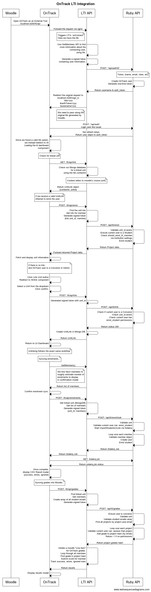

# OnTrack LTI Integration

## Description

This API acts as a bridge between OnTrack’s Ruby API and LTI.js. The Angular frontend communicates with:

• LTI.js API → http://localhost:4200/lti

• Ruby API → http://localhost:4200/api

LTI.js simplifies integration with LMS platforms, while the Ruby API manages most permissions and institution-specific logic. Together, they enable enrolment syncing, and grade exchange between OnTrack and an LMS.

## Permissions & Roles

Most permissions are handled by OnTrack's Ruby API. This means you will already need to have the Convenor role of a unit to be able to link the unit to a [Context](https://www.imsglobal.org/spec/lti/v1p3#contexts-and-resources), and run actions such as syncing enrolments, and importing portfolio grades. These permissions can be modified in the Institution Settings within the Ruby API.

#### Convenors:

- Can link LMS course contexts to OnTrack units.
- Can sync LMS enrolments into OnTrack.
- Can import OnTrack portfolio grades.

#### Automatic Account Handling:

- Any user launching the external tool gets an OnTrack account automatically, using the email and account details used in the LMS.
- If a unit is linked, they are auto-enrolled.

```yaml
Tool Name: OnTrack
Tool URL: http://localhost:4200/lti/
LTI Version: LTI 1.3
Public Key Type: Keyset URL

Public keyset URL: http://localhost:4200/lti/keys

# If moodle is running in a Docker container, you need to specify `host.docker.internal` so that it can make a fetch request to moodles public keys
Public keyset URL: http://host.docker.internal/lti/keys

# These routes are loaded in the browser, and can reach localhost

Initiate login URL: http://localhost:4200/lti/login
Redirection URI(s): http://localhost:4200/lti/
```

## Configuring the Lti API Environment variables

```yaml
HOST: http://localhost:4200

PORT: 3002
LTI_KEY: your-secret-lti-key

PLATFORM_URL: http://localhost/moodle
PLATFORM_NAME: Moodle Test Environment
# Once you have added OnTrack as an external tool, you can retrieve its client ID and add it here
PLATFORM_CLIENT_ID: your-client-id
PLATFORM_AUTHENTICATION_ENDPOINT: http://localhost/moodle/mod/lti/auth.php
PLATFORM_ACCESS_TOKEN_ENDPOINT: http://localhost/moodle/mod/lti/token.php
PLATFORM_AUTHCONFIG_METHOD: JWK_SET
PLATFORM_AUTHCONFIG_KEY: http://localhost/moodle/mod/lti/certs.php

# MongoDB details
DB_HOST: localhost:27017
DB_NAME: ltidb
DB_USER:
DB_PASS:

# Secret key used by the Ruby API to decode our custom LTI tokens.
# Must match the value configured in the Ruby API.
LTI_SHARED_API_SECRET: your-secret-shared-api-secret
```

## Sequence diagram

[View Sequence Diagram](https://www.websequencediagrams.com/?lz=dGl0bGUgT25UcmFjayBMVEkgSW50ZWdyYXRpb24KCk1vb2RsZS0-ABoHOiBPcGVuACYJYXMgYW4gRXh0ZXJuYWwgVG9vbFxubG9jYWxob3N0OjQyMDAvbHRpL2FwaQoAXActPkxUSSBBUEk6IEZvcndhcmQgdGhlIHJlcXVlc3QgdmlhIG5naW54Cm5vdGUgbGVmdCBvZgCBEwUALwVUcmlnZ2VycyBMVEkncyBgb25Db25uZWN0YFxuSGVyZSB3ZSBoYXZlAFAFbHRpawoAaAcAbQtVc2UgR2V0TWVtYmVycyBBUEkgdG8gZmluZFxubW9yZSBpbmZvcm0AgX0FIGFib3V0IHRoZVxuYwBkBmluZyB1c2VyLFxudXNpbmcAYgUuAFUTR2VuZXJhdGUgYSBzaWduZWQgdG9rZW4ARAV0YWluAEEIAGQMAD0LUnVieQCCIwZQT1NUOiAnL2FwaS9hdXRoL2x0aScAghsGb3ZlciAAIApUb2tlbjoge25hbWUsIGVtYWlsLCByb2xlcywgZXRjfQoATQgAUwxDcmVhdACDegp1c2VyXG4AgTQJb25lLXRpbWUAgTcGADYLAIM_CVJldHVybgCCDwVuYW1lICYgYXV0aF8AKgYAgnYJAIQ5CVJlZGlyZWMAglAFIG9yaWdpbmFsAIN4CXRvAIQxEXNpZ25faW5cbj9sdGlrPXh4eFxuJmF1dGgAgWkFPXl5eVxuJgB2CD16enoAhCUXV2UgbmUAgwEFIHBhc3MgYWxvbmcAg1UGAH4JbHRpayBnAIMyB2QgYnlcbm0AhX4FLgCFNwoAgn8aJ1xuTG9naQCCBgYgbGlrZSB1c3VhbC4Agm0LAIZBCVNldCByZWZyZXNoAIQTBi5cbgCCQAsgb2JqZWN0AIJADgCGPAkAPAppbmMAhXEFZm91bmQgYSB2YWxpZACBQgZwYXJhbSxcbndlIGluc3RlYWQgcgCCdAlvIC9sdGlcbkxvYWRpAIICBiBsdGkgZGFzaGJvYXJkXG5jb21wb25lbnQAhGELAIgACUNoZWNrIGZvciBsaW5rZWQgdW5pdACHUxNHRVQ6AGYFAIU6BWxpbgCGfxQARwZvdXIgTW9uZ28gZGF0YWJhc2VcbmZvciBhAFcMAIZuCACHWQguY29udGV4dElkAIYHCwBPCgAXBiByZWZlcnMgdG8gAINJBidzIGNvdXJzZSAodW5pdCkAhzULAIUeCwCFUwVVbml0TGluawCDCgdcbnsAaQksAIFwBUlkfQCCDRRJZiB3ZSByZWNlaXZlAIMQCQBGCFxuQXR0ZW1wAIMFBWVucm9sAIoDBXVzZXIAhGALAIojCQCHfQYAgj4JACwFAIlIE0ZpbgCKSgZ1bml0AIMUBVxuR2V0AIlNBQCDJwVtAIlwBQCHVAsAiQwOe2xpbmsudW5pdF9pZCwAJwd9AIh6GgCDTgZ0AIEJCACIShRWYWxpZGF0AIENBl9pZCBleGlzdHNcbkVuc3VyZSBjdXJyZW50AIoDB3MgYSBTdHVkZW50XG4AhF0Gc2hvdWxkXwCCHwVfbHRpXwCBPAh2aWEAhVMFaXR1AIsmBXNldHRpbmcAVgVyb2wgcwBCBgCJGBtQcm8Ahl8FZGF0YQCDbhQAjRoIcgCJXQVlZAAiDwCGfBJGZXRjaCBhbmQgZGlzcGxheQCDAwYAjEYLAIQTF3RoZXJlIGlzIG5vAIZLBS4uXG5hbmQAiwgNAIIYBkNvbnZlbm9yIG9yIEFkbWluLi5cAIgFFENsaWNrIACFNAVVbml0IGJ1dHRvblxuAIp1CgCHfAYAhw4FIACHYQoAiFATZWxlY3QgYQBCBmZyb20Ajy4FZHJvcGRvd25cbgBlBmNvbmZpcm0AhRsjAIduFwCOKAhkAI4iDSB3aXRoAIQ1CACEZyMAiF0FAI1UEwCJKgZpZgCEXhMAgksIAIRqCACFGhAAiWUGAIUcDWhhc1xuOgCFDgYAhGEHIHBlcm1pc3Npb25zAI4MG3N0YXR1cyAyMDAAiXQUAI8FBgCIaglpbgCKCgdEQgCIfyMAjAwTAI8VB3RvIEx0aSBEAItUCACLPRRVbmxpbmtpbmcgZm9sbG93cwCTFAVleGFjdCBzYW1lIHdvcmtmbG93LgCLexRTeW5jaW5nAIlFBm1lbnRzLi4AiTUUAJJvCigpAI8OGmZpcnN0IGYAhkkFAIktBnMAkBUFcm91Z2hseSBlc3RpbWF0ZSBudW1iZXIgb2ZcbgBwCiB0bwCGeAhcbmluAIUSCACTSwZtb2RhbACLVBtsaXMAlG4FAHAHAIdSFEMAhWQGAIFiCiBzeW5jAIsPKACCGAUAlBoVAIssBgCORAcgKACOBgVEQikAiz0GAIEJDwCLKRoAiy8PcwCLFikvYnVsAIYmFQCLNg5cbgCLSgkAiy8NY2FuIACGBA5cblN0YXJ0IEltcG9ydACLUAdzTHRpSm9iAJdlBVNpZGVraXEAlQEVTG9vcACVWQZlYQCDfQkAcQsAjUQGAI8MCQCVPgcAlTcGAItYKAB5ByBKb2IAj2YaABkMAJNxEwCRWwUAQQhqb2IAk1cUAIdzCAAcCgCIAAcAkz4TT25jZQCLCgVsZXRlLFxuAIxBCENTViBSZXN1bHQAhT0GXG4oc3VjY2VzcywgZXJyb3JzLCBpZ25vcmVkAIZSBwCHCxZncmFkZXMgaW50byAAm1gGAIcTFgCQYw8AMQYAkFsYAJMTDUdldACFHAoAmFYHYXJyYXkgb2YgYWwAjxAJAJkaBgCFMhgAkFIjAIENBwCZQBQAkFYHAJBNCGMAi1kJAIUzGACBBg4AgSoGXG4AkksFYWxsIHAAkCQGcyBieQAECC4AkycFAJpfBQCFHSQAOwcAhiEdYXNzZXNzIHRoYXQAJgpBZGQAgy8GAJk0BQCRKwdoYXNoIChieQCbXgYpAJgxCS0xIGlmIG5vAIxmJwBHCACEDgdoYXNoAJ4fEkluaXRpAJ1CBgCaBgYgIkxpbmUgaXRlbSIAlxwGAKA4CACEVwYuXG4AhzkFdGgAiysFAINvBQCJLgkAlR4FAIFKBmkAdwpoYXNoXG5TdWJtaXQgc2NvcmUAlSINAKEYBgCFWBggcm93AIpHCwCXMRByAIYxBQCGWBREAJMeBwAbBwCMFgYK&s=default)


